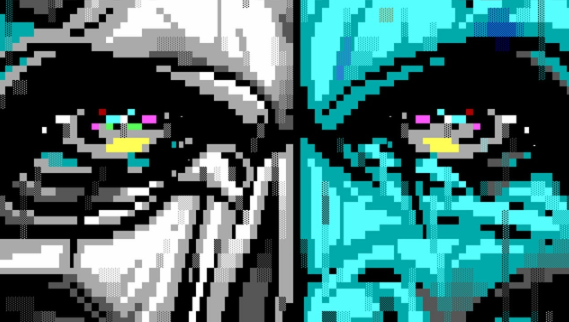

<h1 align="center">IRC ART</h1>

	

The term "IRC Art" is used to refer to text based visual art found on IRC. The art found on IRC has evolved past using just ASCII charcters. IRC clients today understand a number of special formatting characters. These characters allow IRC software to send and receive colors and formatting codes such as bold, italics, underline and others. This allows more possibilites now for creating ASCII/ANSI art for IRC. While it is possible to have support for 99 or even 256 colors, most art made for IRC follows the 16 color standard.

## Table of Contents
- [Setup](#setup)
- [Resources](#resources)
  - [Art Packs](#art-packs)
  - [Convert](#convert)
  - [Drawing](#drawing)
    - [Software](#software)
    - [Web Based](#web-based)
  - [Other](#other)
- [Websites](#websites)
- [IRC Channels](#irc-channels)

***

### Setup
In order to view IRC art propely, a **monospace** font is required to be used for your terminal or graphical client, aswell as full support for viewing UTF-8 unicode characters. Make sure your systems locale is set properly & that your client is setup for UTF-8 support.

It is also recommended that you remove or shorten any client-side message throttling, globally or per-network. See your IRC clients documentation on how to modify the message sending rates.

***

### Resources
#### Art Packs

###### ASCII Fart Packs
| Pack                                                          | Description                                  |
| ------------------------------------------------------------- | -------------------------------------------- |
| [ASCII Art Farts](http://www.asciiartfarts.com)               | Big collection of shitty ASCII only art      |
| [Unicode Art](http://xahlee.info/comp/unicode_ascii_art.html) | Small collection of nice looking unicode art |

###### ANSI Art Packs
| Pack                                                                    | Description                                                         |
| ----------------------------------------------------------------------- | ------------------------------------------------------------------- |
| [Blocktronics](https://github.com/blocktronics/artpacks)                | Archive of ANSI art from [blocktronics](http://blocktronics.org/)   |
| [SixteenColors](https://github.com/sixteencolors/sixteencolors-archive) | Archive of ANSI art from [sixteencolors](http://sixteencolors.net/) |

**Note:** These will not work on IRC unless they are converted into IRC art! *(see [Tools/Convert](#convert))*

###### IRC Art Packs
| Pack                                                         | Description                                                                   |
| ------------------------------------------------------------ | ----------------------------------------------------------------------------- |
| [asciiart](https://github.com/birdneststream/asciiart)       | IRC Art collection maintained by jewbird                                      |
| [IRCArt](https://github.com/ircart/ircart)                   | Massive collection of organized IRC art *(contains art from all art packs)*   |
| [MiRCART](https://mircart.org/)                              | Art pack made by the [MiRCART](https://mircart.org/) crew                     |
| [PP4L](http://wepump.in/ascii/)                              | Art pack made by the [PP4L](http://wepump.in/) crew                           |
| [TrollASCII](https://github.com/jakkm3n/trollascii)          | Giant mess of unorganized art                                                 |
| [Volatile](https://git.volatile.bz/cgit/wowaname/ascii-art/) | Art pack containing other packs & some OC by [volatile](https://volatile.bz/) |

**Note:** The [IRCArt](https://github.com/ircart/ircart) repository listed above contains all the art from the other packs, has been heavily organized, and is constantly being updated with new art.

#### Convert
| Name                                            | Description                                                                                                    |
| ----------------------------------------------- | -------------------------------------------------------------------------------------------------------------- |
| [a2m](https://github.com/tat3r/a2m)             | Convert ANSI art to IRC art    *([mirror](https://github.com/internet-relay-chat/random/tree/master/art/a2m))* |
| [bwu](https://git.trollforge.org/bwu/)          | Convert images to braille art  *([mirror](https://github.com/internet-relay-chat/random/tree/master/art/bwu))* |
| [p2u](https://git.trollforge.org/p2u/)          | Convert images to ANSI/IRC art *([mirror](https://github.com/internet-relay-chat/random/tree/master/art/p2u))* |
| [irc2ansi](https://github.com/timb/irc2ansi)    | Convert IRC art to ANSI art for your terminal                                                                  |
| [irc2html](https://ircart.github.io/irc2html/)  | Convert IRC art to HTML                                                                                        |
| [img2term](https://github.com/wwared/img2term)  | Output images in your terminal                                                                                 |
| [RuinIRC99](https://ruinirc99.firebaseapp.com/) | Convert images to IRC art from your browser                                                                    |

#### Drawing
###### Software
| Name                                                 | Description                                                      |
| ---------------------------------------------------- | ---------------------------------------------------------------- |
| [ACiDDraw](http://www.acid.org/apps/apps.html)       | Old school ANSI art drawing tool                                 |
| [asciibird](https://github.com/hughbord/asciibird)   | New-school IRC ASCII Editor                                      |
| [asciipumper](https://github.com/ircart/asciipumper) | MS-Paint style program to draw IRC art *(archived)*              |
| [asciishade](https://github.com/mikedesu/asciishade) | Command line program to draw IRC Ar                              |
| [durdraw](https://github.com/cmang/durdraw)          | Command line program to draw ANSI art                            |
| [IRC-Paint](https://github.com/wwared/IRC-Paint)     | MS-Paint style program to draw IRC art *(archived)*              |
| [moebius](https://github.com/blocktronics/moebius)   | ANSI drawing tool from [blocktronics](https://blocktronics.org/) |
| [PabloDraw](http://picoe.ca/products/pablodraw/)     | Old school ANSI art drawing tool                                 |
| [Roar](https://github.com/lalbornoz/roar)            | Editor & Tools                                                   |

###### Web Based
| Name                                                | Description                                    |
| --------------------------------------------------- | ---------------------------------------------- |
| [ASC_Paint](https://asc-paint.glitch.me/)           | Draw ANSI art from your browser                |
| [asciiblaster](https://asdf.us/asciiblaster/)       | Draw IRC/ANSI art from your browser            |
| [asciimaker](https://ircart.github.io/asciimaker/)  | Draw IRC art from your browser                 |
| [ansiedit](https://github.com/andyherbert/ansiedit) | Network-enabled web based ANSi art application |
| [bashfill](https://max.io/bash.html)                | Draw art for your terminal                     |
| [kaeditor](https://www.roarie.cat/kaeditor/)        | Draw IRC art from your browser                 |
| [FSymbols Draw](https://fsymbols.com/draw/)         | Draw unicode block art in your browser         |

#### Other
| Name                                                                                    | Description                                                                        |
| --------------------------------------------------------------------------------------- | ---------------------------------------------------------------------------------- |
| [UniColExport](https://github.com/klopsi/unicolexport)                                  | Unicode block-character graphic exporter for [GIMP](https://www.gimp.org/)         |
| [Limnoria ASCII Plugins](https://github.com/oddluck/limnoria-plugins/tree/master/ASCII) | ASCII plugins for [Limnoria](https://github.com/ProgVal/Limnoria)                  |
| [lolbot](https://github.com/knivey/lolbot)                                              | IRC bot with lots of ASCII features                                                |
| [MiRCARTools](https://github.com/lalbornoz/MiRCARTools)                                 | IRC art editor & tools                                                             |
| [Scroll](https://github.com/ircart/scroll)                                              | Very functional IRC bot to play art & more                                         |
| [TDFiglet](https://github.com/tat3r/tdfiglet)                                           | Convert text to [TheDraw](https://www.roysac.com/thedrawfonts-tdf.html) ANSI fonts |

***

### Websites
- [BlockTronics](http://blocktronics.org/)
- [MiRCART](https://mircart.org/)
- [PP4L](http://wepump.in/)
- [SixteenColors](https://16colo.rs/)

***

### IRC Channels
| Channel      | Network                             |
| ------------ | ----------------------------------- |
| **##ascii**  | [Freenode](https://freenode.net/)   |
| **#ascii**   | [EFNet](http://efnet.org/)          |
| **#ircart**  | [EFNet](http://efnet.org/)          |
| **#mircart** | [EFNet](http://efnet.org/)          |
| **#scroll**  | [SuperNETs](https://supernets.org/) |

Send us an [email](mailto://acid.vegas@acid.vegas) if you have an IRC channel dedicated to art!